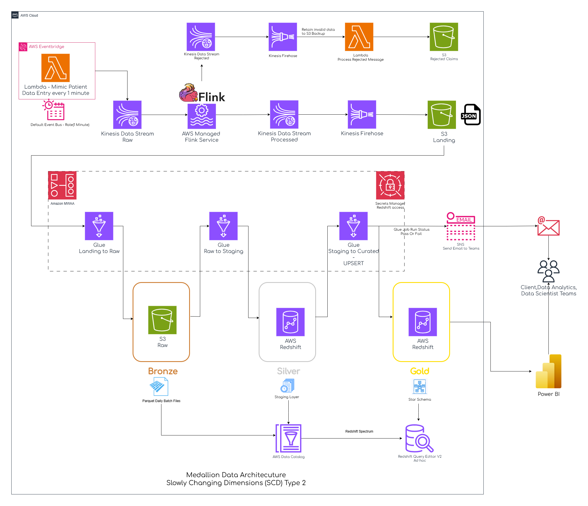
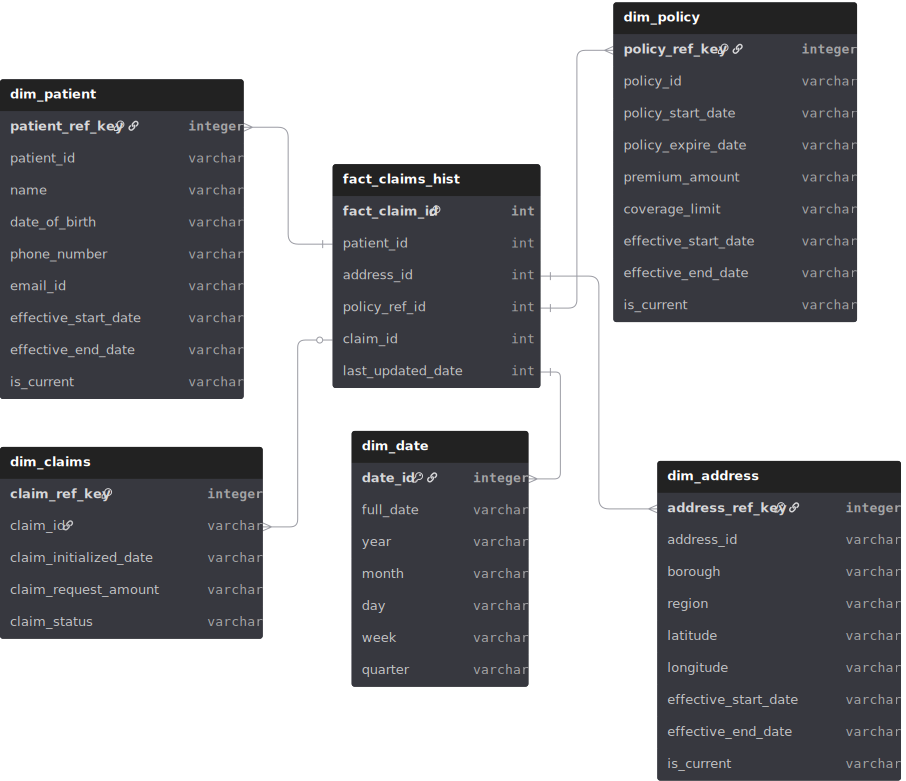

# 🏥 Hospital Patients & Claims ETL Analytics Pipeline

An end-to-end AWS Data Engineering project demonstrating the design and implementation of a scalable ETL pipeline using AWS Glue, Amazon S3, and Amazon Redshift.

This project processes hospital patient and claims data through a structured Medallion architecture and prepares analytics-ready datasets for reporting and business intelligence.

---

## 📌 Project Overview

This pipeline simulates a real-world healthcare data engineering use case where patient and claims data are:

- Extracted from raw sources from Kinesis to S3 via Flink
- Transformed using PySpark in AWS Glue
- Loaded into Amazon Redshift
- Structured using dimensional modeling
- Prepared for analytical consumption

The architecture follows a Medallion-style layered approach (Raw → Staging → Curated).

---
## 🏗️ Architecture


### 🔹 Data Flow

1. Data is getting generated from lambda to s3 via Kinesis
2. Inital data handling and filteration is done through Flink and loaded to Firestore
3. Raw data from Kinesis Firehose is processed into Amazon S3 (CSV format)
4. AWS Glue ETL jobs process and transform the data using PySpark
5. Cleaned and structured data is written back to S3 Staging layer
6. Data is loaded from Staging layer into Curation layer of Amazon Redshift for analytics
7. SQL queries are used for reporting and insights using Power BI

---

## 🧠 Technologies Used

- AWS Glue (ETL processing)
- Amazon S3 (Data Lake Storage)
- Amazon Redshift (Data Warehouse)
- Python
- PySpark
- SQL

---

## 📂 Repository Structure

```
etl-glue-hospital-patients-claims-analytics/
│
├── glue_job_scripts/          # AWS Glue PySpark ETL scripts
├── redshift_sql_queries/      # SQL scripts for schema & analytics
├── data_lookup/               # Lookup/reference datasets
├── data_producer/             # Sample data generation scripts
├── flink_sql_queries/         # Flink SQL queries from AWS Managed Service for Flink 
├── er_schema_design/          # ER diagram & schema design files
├── images/                    # Architecture diagrams
├── README.md
└── LICENSE
```

---

## 🔄 ETL Pipeline Workflow

### Step 1: Data Generation
- Hospital Patients and Claims data is getting generated from Lambda execution and sent to AWS Kinesis Stream for every 1 minute via Default Event bus
- Generated data will be getting processed via AWS Managed Service for Flink Analytics
- Processed data will be pushed to Kinesis Firehose to load data to S3 location

### Step 2: Data Ingestion - Landing to Raw
- Upload of hospital patients and claims datasets to Amazon S3 (landing layer) from Kinesis Firehose

### Step 3: Transformation (AWS Glue) - Raw to Staging
- Data cleansing
- Schema standardization
- Deduplication
- Business rule implementation
- Slowly Changing Dimension (SCD Type 2) logic

### Step 4: Load to Redshift - Staging to Curation
- Creation of dimension and fact tables
- Optimized SQL transformations
- Aggregation queries for analytics

---

## 📊 Data Modeling



The warehouse follows a dimensional model:

- Fact Table: Claims History
- Dimension Tables:
  - Patients
  - Policy
  - Claims
  - Address
  - Date

This structure enables efficient analytical queries and BI reporting.

---

## 🚀 How to Run

1. Clone the repository:
   ```
   git clone https://github.com/SatoruGojo16/etl-glue-hospital-patients-claims-analytics.git
   ```

2. Set up AWS resources:
   - Create S3 buckets (raw and curated)
   - Configure AWS Glue job and IAM role
   - Launch Amazon Redshift cluster

3. Upload source data to S3

4. Deploy and execute Glue job scripts

5. Run SQL scripts in Redshift

---

## 📈 Example Use Cases

- Analyze patient admission trends
- Identify high-cost treatment categories
- Claims approval rate analysis
- Provider performance tracking

---

## 🏆 Key Learning Outcomes

- Building serverless ETL pipelines using AWS Glue
- Implementing Medallion architecture
- Designing dimensional data models
- Applying SCD Type 2 for historical tracking
- Writing optimized SQL for analytics workloads

---

## 📜 License

This project is licensed under the MIT License.
